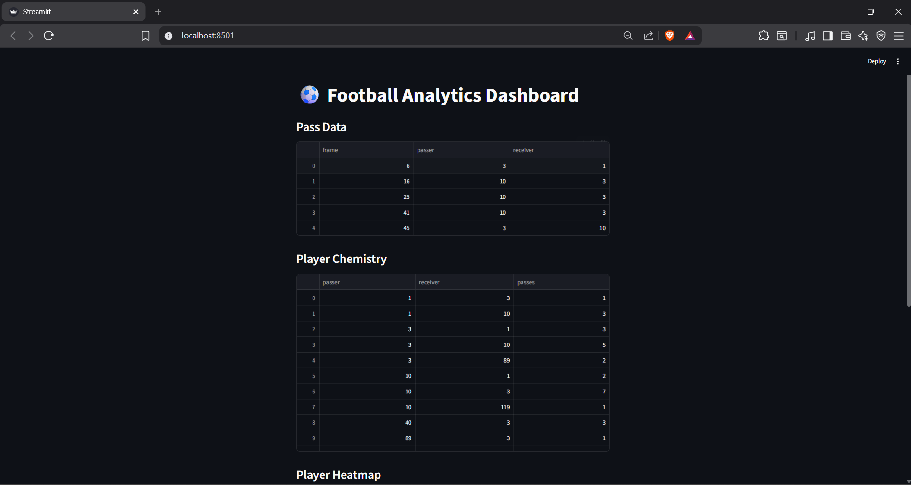

# ⚽ Football Player Chemistry Analysis

## 📌 Overview

This project analyzes football match videos to estimate **player chemistry** using computer vision and data processing techniques.

It combines **two complementary approaches**:

* Pass-based interactions (fast but noisy)
* Spatial proximity analysis (accurate but computationally expensive)

---

## 🚀 Features

* Player detection using YOLOv8
* Player tracking across frames
* Ball detection
* Pass estimation based on possession changes
* Two chemistry models:

  * Pass-based chemistry
  * Proximity-based chemistry
* Hybrid chemistry scoring
* End-to-end data pipeline
* Streamlit dashboard visualization

---

## Architecture

The project is divided into two main layers:

- Core: data processing and chemistry computation
- Analytics: visualization and insights generation

This separation ensures modularity and scalability.

## 🧠 Methodology

### Pipeline:

Video
↓
Player Detection (YOLO)
↓
Tracking (assign IDs across frames)
↓
Ball Detection
↓
Possession Estimation
↓
Pass Detection
↓
Chemistry Computation

---

## 📊 Chemistry Models

### 1️⃣ Pass-Based Chemistry

* Based on number of passes between players
* Fast to compute
* Sensitive to tracking noise

---

### 2️⃣ Proximity-Based Chemistry

* Measures how often players are spatially close
* More stable
* Computationally expensive

---

### 3️⃣ Hybrid Chemistry (Final Score)

Final Score = 0.6 × Pass Score + 0.4 × Proximity Score

---

## 📈 Output Example

| Player 1 | Player 2 | Pass Score | Proximity Score | Final Score |
| -------- | -------- | ---------- | --------------- | ----------- |
| 3        | 10       | 0.40       | 0.30            | 0.36        |
| 10       | 1        | 0.25       | 0.20            | 0.23        |

---

## 📊 Dashboard Preview



---

## 🛠️ Tech Stack

* Python
* OpenCV
* YOLOv8 (Ultralytics)
* Pandas
* NumPy
* Streamlit
* Matplotlib
* tqdm

---

## ▶️ How to Run

### 1️⃣ Install dependencies

pip install -r requirements.txt

---

### 2️⃣ Run the pipeline

python pipeline.py

---

## 📂 Project Structure

```
player-chemistry-analysis/
│
├── src/                          # 💻 Source code
│   ├── core/                     # 🧠 Chemistry computation (backend)
│   │   ├── pass_chemistry.py         # Fast interaction-based chemistry
│   │   ├── proximity_chemistry.py    # Spatial proximity-based chemistry
│   │   └── final_chemistry.py        # Hybrid combined score
│   │
│   ├── analytics/                # 📊 Visualization & analysis
│   │   ├── pass_network.py           # Pass network graph
│   │   └── player_heatmap.py         # Player movement heatmaps
│   │
│   ├── detection/                # 🎯 Player detection (YOLO)
│   ├── tracking/                 # 🧭 Player tracking across frames
│   └── utils/                    # 🔧 Helper functions
│
├── data/                         # 📁 Data (ignored except samples)
│   ├── sample_output/            # 📊 Example outputs
│   │   ├── final_chemistry.csv
│   │   └── dashboard.png
│
├── models/                       # 🤖 Model weights (ignored in Git)
│
├── dashboard.py                  # 📊 Streamlit dashboard
├── pipeline.py                   # ⚙️ Full pipeline execution
├── main.py                       # 🚀 Entry point (optional)
│
├── requirements.txt              # 📦 Dependencies
├── .gitignore                    # 🚫 Ignored files
└── README.md                     # 📖 Documentation
```


streamlit run dashboard.py

---

## 📂 Project Structure

player-chemistry-analysis/
│
├── src/
│   ├── core/                     # 🧠 Chemistry computation (backend)
│   │   ├── pass_chemistry.py         # Fast interaction-based chemistry
│   │   ├── proximity_chemistry.py    # Spatial proximity-based chemistry
│   │   └── final_chemistry.py        # Hybrid combined score
│   │
│   ├── analytics/               # 📊 Visualization & insights
│   │   ├── pass_network.py          # Pass network graph
│   │   └── player_heatmap.py        # Player movement heatmaps
│   │
│   ├── detection/               # 🎯 Player detection (YOLO)
│   ├── tracking/                # 🧭 Player tracking across frames
│   └── utils/                   # 🔧 Helper functions
│
├── data/
│   ├── sample_output/           # 📁 Example outputs (for GitHub preview)
│   │   ├── final_chemistry.csv
│   │   └── dashboard.png
│
├── models/                     # 🤖 YOLO weights (ignored in Git)
│
├── dashboard.py               # 📊 Streamlit dashboard (UI layer)
├── pipeline.py                # ⚙️ Runs full processing pipeline
├── main.py                    # 🚀 Entry point (optional)
├── requirements.txt           # 📦 Dependencies
├── .gitignore                 # 🚫 Ignore large files/models
└── README.md                  # 📖 Project documentation


---

## ⚠️ Limitations

* Ball detection is difficult due to size and motion
* Player tracking IDs may switch
* Pass detection is an approximation
* Single-camera setup limits accuracy

---

## 📈 Future Improvements

* Multi-camera tracking
* Custom-trained ball detection model
* Team-aware chemistry filtering
* Real-time processing
* Improved tracking stability

---

## 👤 Author

Your Name

---

## 💡 Key Insight

This project demonstrates how combining multiple imperfect models can produce a more reliable analytical system.

Instead of relying on a single method, we fuse:

* Interaction-based signals (passes)
* Spatial relationships (proximity)

to better approximate real football dynamics.
